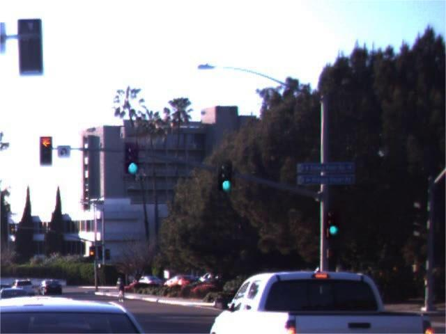
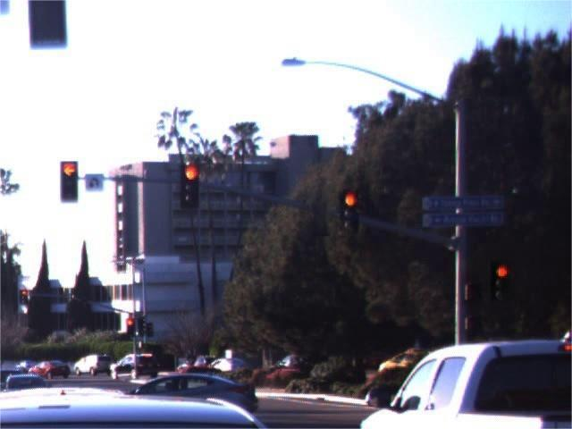
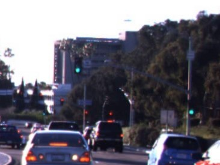
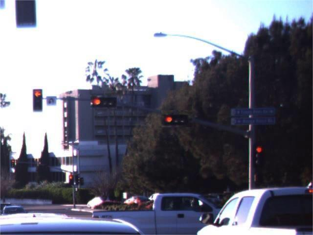
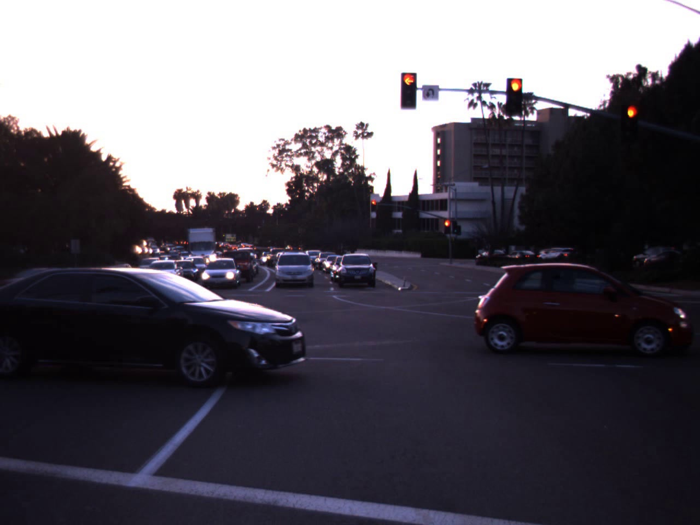
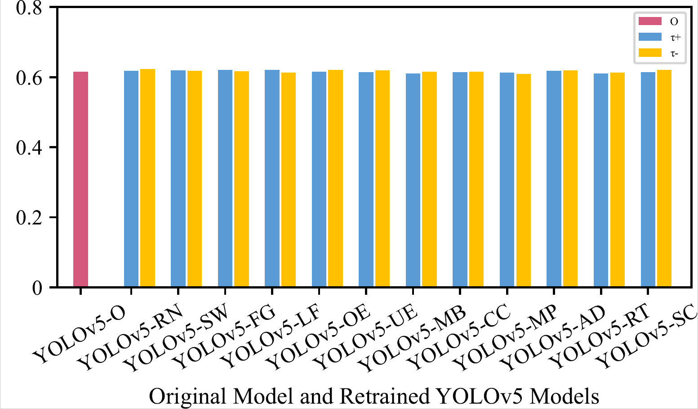
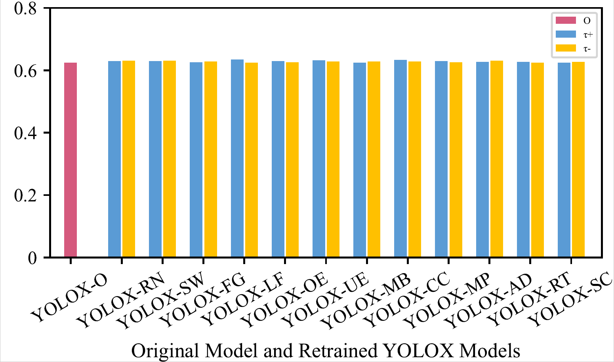

Autonomous vehicle technology has been developed in the last decades with recent advances in sensing and computing technology. There is an urgent need to ensure the reliability and robustness of autonomous driving systems (ADSs). Despite the recent achievements in automatically testing various modules of ADSs, little attention has been paid on the automated testing of traffic light detection models in ADSs. A common practice is to manually collect and label traffic light data. However, it is labor-intensive, and even impossible to collect diverse data under different driving environments.
To address these problems, we propose and implement **TigAug** to automatically augment labeled traffic light images for testing traffic light detection models in ADSs. We construct two families of metamorphic relations and three families of transformations based on a systematic understanding of weather environments, camera properties, and traffic light properties. We use augmented images to detect erroneous behaviors of traffic light detection models by transformationspecific metamorphic relations, and to improve the performance of traffic light detection models by retraining. Large-scale experiments with four state-of-the-art traffic light detection models and two traffic light data sets have demonstrated that (i) **TigAug** is effective in testing traffic light detection models, (ii) **TigAug** is efficient in synthesizing traffic light images and retraining models, and (iii) **TigAug** generates high-quality traffic light images without the need of cleaning.

The paper has been submitted to ASE 2023.

## Methodology

We design and implement **TigAug** as a systematic dataa ugmentation approach to automatically augment labeled traffic light images for testing traffic light detection models in ADSs. The figure below  shows an overview of **TigAug**. It is built upon our domain understanding of how weather environments, camera properties, and traffic light properties affect the traffic light images captured by cameras in real-world environments. We construct two families of metamorphic relations  and three families of transformations  with respect to weather environments, camera properties, and traffic light properties. 

On the basis of our domain analysis, **TigAug** first applies transformations on labeled traffic light data from real world (i.e., real-world data) to generate augmented traffic light data (i.e., augmented data). Then, **TigAug** uses transformation-specific metamorphic relations between the real-world testing data and those augmented testing data to identify erroneous behaviors of traffic light detection models trained from real-world training data. Moreover, **TigAug** retrains traffic light detection models by adding augmented training data to real-world training data so as to improve model performance.

## Samples of Our Augmented Datasets

Here are some samples of our augmented datasets.

In the paper, we describe the implementation of 12 transformation techniques in detail . What sets our work apart from previous research is that when transforming images, we aim to make them as realistic and close to reality as possible. In addition to traditional weather transformations, we have designed transformation specifically for traffic lights themselves in order to enrich the diversity of positions and states of traffic lights in images and ensure the synthesized traffic lights still follow existing regulations as much as possible.

|        |           O            |           A            | Descriptions                                                 |
| ------ | :--------------------: | :--------------------: | :----------------------------------------------------------- |
| **CC** |   |   | In Bai et al.’s work, the color of the traffic light is changed by labeling the traffic light bulb and assigning a single color (such as red (255, 0, 0)) to the bulb according to certain rules. On the contrary, we use HSV to change the color tone of traffic lights, which can make the generated images closer to real world and does not require additional labeling of traffic light bulbs. |
| **MP** |   |   | To make the generated images closer to real life, we only move traffic lights by a small distance when changing the position of traffic lights, ensuring that the traffic lights are still on the lamppost, rather than in other unreasonable places. |
| **AD** |  |  | Adding traffic lights directly to the image may violate the corresponding regulations, but we have noticed that in daily life, in order to prevent a certain traffic light from brocken or being blocked, sometimes there are two completely consistent traffic lights at the same intersection. Considering this situation, we choose to add a consistent traffic light in the image adjacent to the traffic light and ensure that it is on the lamp holder. |
| **RT** |   |   | By rotating the traffic lights, we transform the originally vertical traffic lights into horizontal traffic lights, which we believe has practical significance in real life. |
| **SC** |   |   | Compared to directly changing the size of traffic lights in the image, we choose to expand the image and compress it back to its original size, mimicing the effect of taking the image from a larger distance. |

**All the augmented datasets, models we use, and codes  for transformations are available [here](https://zenodo.org/record/7694860).**

## Research Questions

We design the following four research questions to evaluate the effectiveness and efficiency of **TigAug**.

- RQ1 :How effective are our augmented traffic light images in identifying erroneous behaviors of existing traffic light detection models?
- RQ2 : How effective are our augmented traffic light images in improving the performance of existing traffic light detection models?
- RQ3 : How is the time overhead of **TigAug** in synthesizing images and retraining models?
- RQ4 : How is the naturalness of augmented traffic light images, and does it affect the performance of existing traffic light detection models?

## Evaluation

Following the procedure presented in the paper, we have conducted a detailed analysis of the above four issues. Here are some charts that were not presented in the paper due to space limitation.

### **mAP of the 8 Retrained Models on Original Dataset, All the Augmented Datasets, and Augmented Datasets of LISA w.r.t 12 Transformations**

|                       |                        |
| --------------------- | ---------------------- |
| YOLOv5 - *LISA*       | YOLOv5 - *Bosch*       |
|                       |                        |
| YOLOX - *LISA*        | YOLOX - *Bosch*        |
|                       |                        |
| Faster R-CNN - *LISA* | Faster R-CNN - *Bosch* |
|                       |                        |
| SSD - *LISA*          | SSD - *Bosch*          |

**The retrained model using all the augmented training datasets together mostly has a slightly higher mAP than the retrained models using one type of augmented training dataset, and performs much better than original model.** 

### **Time consumption**

|  |  |
| :-------------------------------------------------: | :-----------------------------------: |
|                Time for Augmentaion                 |          Time for Retraining          |

**On average, TIGAUG takes 0.88 seconds to syn- thesize an image, and respectively takes 14 and 36 hours to re- train a model by one transformation and all transformations. Given the effectiveness in detecting erroneous behaviors and improving model performance, the time cost is acceptable.**

### **Impact of Unnatural Images**

**mAP of the Original Model and Retrained  Models (by One Transformation) on the Original *LISA* Testing Dataset**

|                                       |                                     |
| ------------------------------------- | ----------------------------------- |
|  |  |

Generally, these three kinds of models achieve similar mAP, indicating that those unnatural data will not affect models’ detection capability on original real-world data.

**mAP of the Original Model and Retrained  Models (by One Transformation) on the Augmented and Cleaned Augmented *LISA* Testing Dataset**

This indicates that retraining models with those unnatural data will not affect models’ capability on natural data.

The original experiment data is available [here](data/TL_test_result.xlsx).

