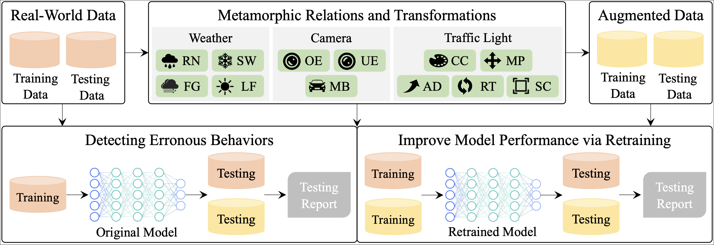
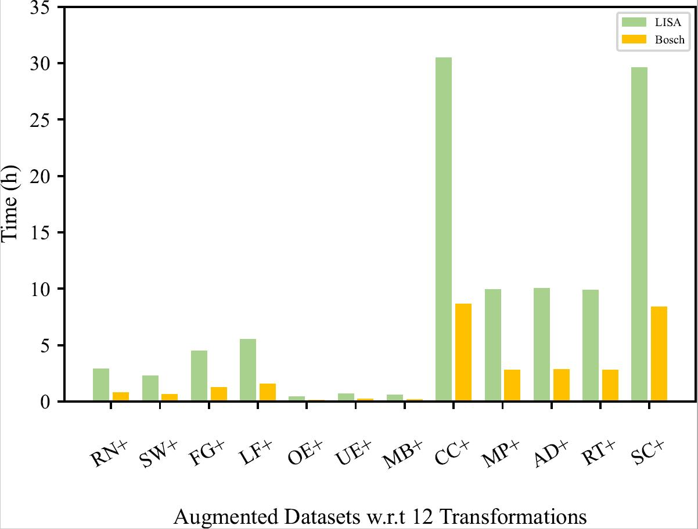
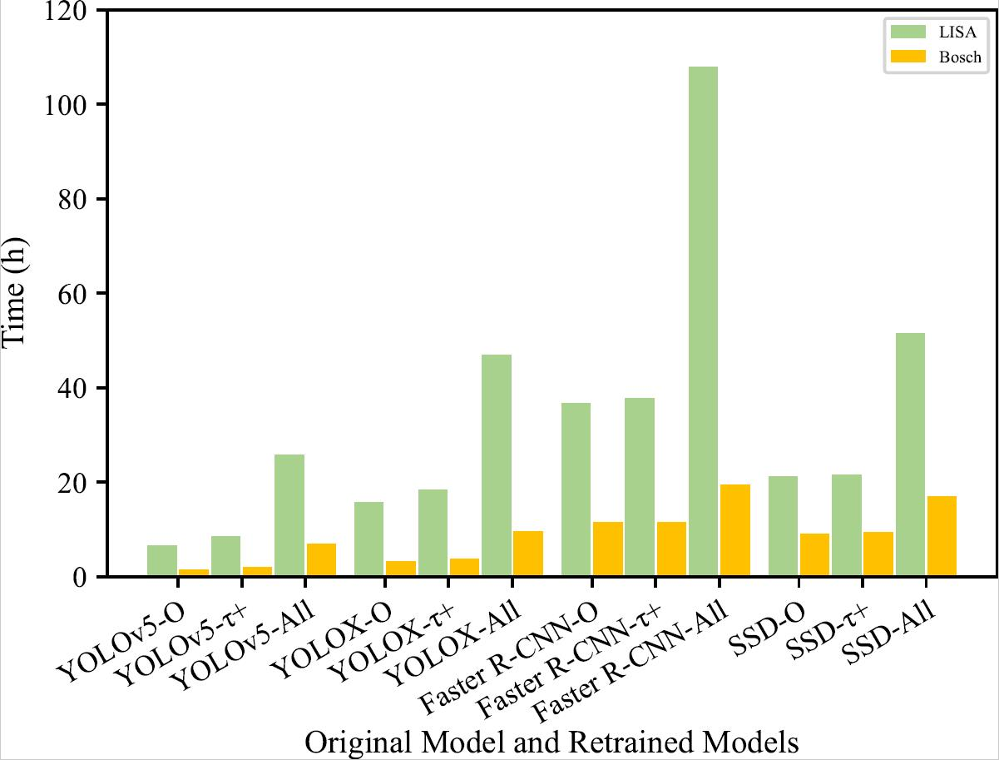

Autonomous vehicle technology has been developed in the last decades with recent advances in sensing and computing technology. There is an urgent need to ensure the reliability and robustness of autonomous driving systems (ADSs). Despite the recent achievements in automatically testing various modules of ADSs, little attention has been paid on the automated testing of traffic light detection models in ADSs. A common practice is to manually collect and label traffic light data. However, it is labor-intensive, and even impossible to collect diverse data under different driving environments.
To address these problems, we propose and implement **TigAug** to automatically augment labeled traffic light images for testing traffic light detection models in ADSs. We construct two families of metamorphic relations and three families of transformations based on a systematic understanding of weather environments, camera properties, and traffic light properties. We use augmented images to detect erroneous behaviors of traffic light detection models by transformationspecific metamorphic relations, and to improve the performance of traffic light detection models by retraining. Large-scale experiments with four state-of-the-art traffic light detection models and two traffic light data sets have demonstrated that (i) **TigAug** is effective in testing traffic light detection models, (ii) **TigAug** is efficient in synthesizing traffic light images and retraining models, and (iii) **TigAug** generates high-quality traffic light images without the need of cleaning.

## Methodology

We design and implement **TigAug** as a systematic dataa ugmentation approach to automatically augment labeled traffic light images for testing traffic light detection models in ADSs. The figure below  shows an overview of **TigAug**. It is built upon our domain understanding of how weather environments, camera properties, and traffic light properties affect the traffic light images captured by cameras in real-world environments. We construct two families of metamorphic relations  and three families of transformations  with respect to weather environments, camera properties, and traffic light properties. 

On the basis of our domain analysis, **TigAug** first applies transformations on labeled traffic light data from real world (i.e., real-world data) to generate augmented traffic light data (i.e., augmented data). Then, **TigAug** uses transformation-specific metamorphic relations between the real-world testing data and those augmented testing data to identify erroneous behaviors of traffic light detection models trained from real-world training data. Moreover, **TigAug** retrains traffic light detection models by adding augmented training data to real-world training data so as to improve model performance.

## Samples of Our Augmented Datasets

Here are some samples of our augmented datasets.

In the paper, we describe the implementation of 12 transformation techniques in detail . What sets our work apart from previous research is that when transforming images, we aim to make them as realistic and close to reality as possible. In addition to traditional weather transformations, we have designed transformation specifically for traffic lights themselves in order to enrich the diversity of positions and states of traffic lights in images and ensure the synthesized traffic lights still follow existing regulations as much as possible.

|    Original images     |    Augmented images    | Descriptions |
| :--------------------: | :--------------------: | :----------: |
|   |   |              |
|   |   |              |
|  |  |              |
|   |   |              |
|   |   |              |

**All the augmented datasets and codes are available [here]().**

## Research Questions

We design the following four research questions to evaluate the effectiveness and efficiency of **TigAug**.

- RQ1 :How effective are our augmented traffic light images in identifying erroneous behaviors of existing traffic light detection models?
- RQ2 : How effective are our augmented traffic light images in improving the performance of existing traffic light detection models?
- RQ3 : How is the time overhead of **TigAug** in synthesizing images and retraining models?
- RQ4 : How is the naturalness of augmented traffic light images, and does it affect the performance of existing traffic light detection models?

## Evaluation

Following the procedure presented in the paper, we have...

Time consumption 

|  |  |
| --------------------------------------------------- | ------------------------------------- |

Naturalness analysis 

